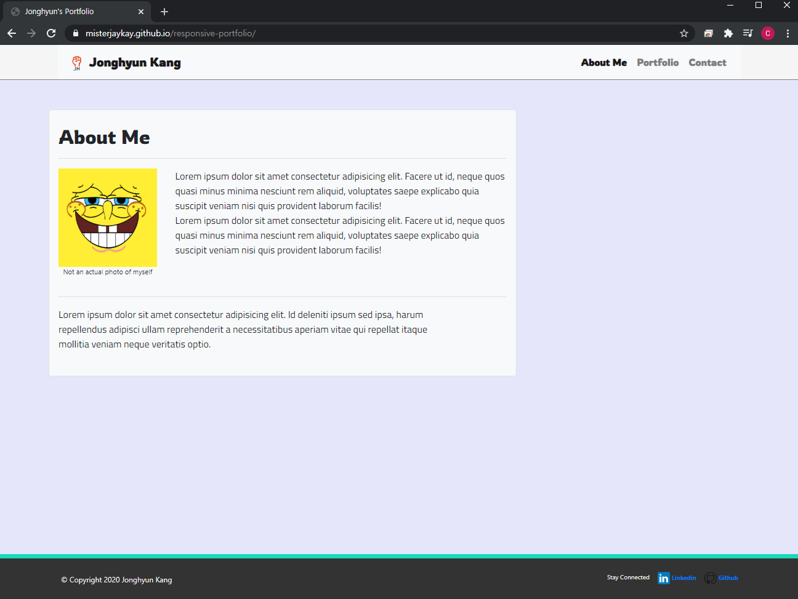

# Homework 2 - Responsive Portfolio

## Built With (Used Languages)

* HTML5
* CSS3

## References
* [Bootstrap](https://getbootstrap.com) - read documetations to built main structures of three html pages.
* [W3Schools](https://www.w3schools.com/) - read several how-to-dos for me to learn or regain knowledge of.
* [Markup Validation Service](https://validator.w3.org/) - to validate HTML page and correct errors in pages.
* [Lolcolors](https://www.webdesignrankings.com/resources/lolcolors/) - to find out which color is popular in web design.
* [Google](https://www.google.com) - used for images.
* [FreeLogoDesign](https://www.freelogodesign.org/) - made a free logo from here.

## Overview (Contents)

This HTML pages are for my Homework 2 - Responsive Portfolio.

In this activity, I created html pages for my future portfolio with the HTML/CSS language that I learned last week.

Each pages ``index.html,portfolio.html,contact.html`` were made to linked to each other using navigation bar on top. 

It is also responsive designed, so If you view pages from different devices (mobile phone, note book, tablet, etc) it will have responsive view for each diffrent devices.

This page is created just for my portfolio and it will be update soon with more detailed design and more interactive action to it, after I learn more new Technologies/Languages.

## Page Preview

## Contact

Jonghyun Kang - misterjaykay@gmail.com

Project Repo Link: https://github.com/misterjaykay/responsive-portfolio

Preview Link: https://misterjaykay.github.io/responsive-portfolio

